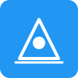

# ExCADvate - Professional Browser-Based CAD Software

A modern, feature-rich CAD (Computer-Aided Design) application that runs entirely in your browser. Built with React, TypeScript, Three.js, and TailwindCSS.



## Features

### Core CAD Features
- **2D Sketching**: Draw lines, circles, arcs, rectangles, polygons, and splines
- **3D Modeling**: Extrude, revolve, loft, sweep, fillet, chamfer, and shell operations
- **Constraints**: Coincident, parallel, perpendicular, horizontal, vertical, tangent, concentric, equal, symmetric, fix, distance, angle, diameter, radius
- **Assembly Design**: Multi-component assemblies with mates and constraints
- **Materials**: Custom materials with physical properties
- **Layers**: Organize your design with layer management

### View & Navigation
- **Multiple View Modes**: Shaded, wireframe, hidden line, rendered, x-ray
- **Interactive Controls**: Orbit, pan, zoom, and selection tools
- **Grid & Snap**: Configurable grid with snap functionality
- **View Cube**: Quick navigation with the gizmo viewport

### File Operations
- **Import/Export**: Support for STL, OBJ, STEP, and IGES formats
- **Project Management**: Save and load projects with .excad format
- **Undo/Redo**: Full history tracking with 50-step buffer

### UI/UX
- **Modern Dark Theme**: Professional CAD interface
- **Dockable Panels**: Customizable workspace layout
- **Feature Tree**: Hierarchical view of design history
- **Property Panel**: Edit entity properties in real-time
- **Status Bar**: Contextual information and coordinates

## Tech Stack

- **Frontend**: React 18 + TypeScript
- **3D Rendering**: Three.js + React Three Fiber
- **State Management**: Zustand
- **Styling**: TailwindCSS
- **Build Tool**: Vite
- **Icons**: Lucide React
- **Geometry**: Custom geometry engine with OpenCASCADE.js integration

## Getting Started

### Prerequisites
- Node.js 18+ 
- npm or yarn

### Installation

```bash
# Clone the repository
git clone https://github.com/yourusername/ExCADvate.git
cd ExCADvate

# Install dependencies
npm install

# Start development server
npm run dev

# Build for production
npm run build

# Deploy to GitHub Pages
npm run deploy
```

### Development

```bash
# Run development server
npm run dev

# Run linter
npm run lint

# Preview production build
npm run preview
```

## Usage

1. **Create a New Project**: File > New or Ctrl+N
2. **Start Sketching**: Select a sketch plane and use drawing tools
3. **Add Features**: Use extrude, revolve, and other features to create 3D geometry
4. **Manage Properties**: Edit entities in the property panel
5. **Export**: Save your design in various formats

### Keyboard Shortcuts

| Shortcut | Action |
|----------|--------|
| Ctrl+N | New Project |
| Ctrl+O | Open Project |
| Ctrl+S | Save Project |
| Ctrl+Z | Undo |
| Ctrl+Y | Redo |
| Ctrl+Shift+S | New Sketch |
| S | Select Tool |
| L | Line Tool |
| C | Circle Tool |
| R | Rectangle Tool |
| A | Arc Tool |
| E | Extrude |
| V | Revolve |
| F | Fillet |
| M | Mirror |
| F | Zoom to Fit |
| H | Pan |
| O | Orbit |
| Del | Delete Selected |

## Architecture

### Project Structure
```
src/
├── components/          # React components
│   ├── Viewport3D.tsx  # 3D viewport with Three.js
│   ├── Toolbar.tsx     # Tool selection toolbar
│   ├── MenuBar.tsx     # Application menu
│   ├── Sidebar.tsx     # Left sidebar panels
│   ├── FeatureTree.tsx # Feature tree panel
│   ├── PropertyPanel.tsx # Property editor
│   ├── StatusBar.tsx   # Bottom status bar
│   ├── SketchRenderer.tsx # Sketch rendering
│   └── BodyRenderer.tsx   # 3D body rendering
├── store/
│   └── cadStore.ts     # Zustand state management
├── types/
│   └── cad.ts          # TypeScript type definitions
├── utils/
│   └── geometry.ts     # Geometry utilities
└── App.tsx             # Main application component
```

### Data Model

The application uses a hierarchical data model:

- **Project**: Top-level container
  - **Assembly**: Collection of components
    - **Component**: Design element with bodies, sketches, features
      - **Body**: 3D geometry with faces, edges, vertices
      - **Sketch**: 2D profile with entities and constraints
      - **Feature**: Operations that create/modify geometry
  - **Materials**: Physical material definitions
  - **Layers**: Organization and visibility control

## Contributing

Contributions are welcome! Please read our [Contributing Guide](CONTRIBUTING.md) for details on:
- Code of Conduct
- Development workflow
- Pull request process

## Roadmap

### Phase 1: Core CAD (Current)
- [x] Basic 2D sketching
- [x] 3D viewport with navigation
- [x] Feature tree
- [x] Property panel
- [ ] Extrude and revolve features
- [ ] Basic constraints

### Phase 2: Advanced Modeling
- [ ] Loft and sweep features
- [ ] Fillet and chamfer
- [ ] Shell and draft
- [ ] Pattern features
- [ ] Advanced constraints solver

### Phase 3: Assembly & Collaboration
- [ ] Assembly constraints (mates)
- [ ] Component insertion
- [ ] BOM generation
- [ ] Version control integration
- [ ] Real-time collaboration

### Phase 4: Professional Features
- [ ] Parametric design
- [ ] Design tables
- [ ] Configurations
- [ ] Simulation integration
- [ ] CAM toolpaths

## License

MIT License - see [LICENSE](LICENSE) file for details.

## Acknowledgments

- Three.js community for 3D rendering excellence
- OpenCASCADE.js for solid geometry kernel
- React and Vite teams for the excellent tooling

---

Built with passion for engineering and design.
